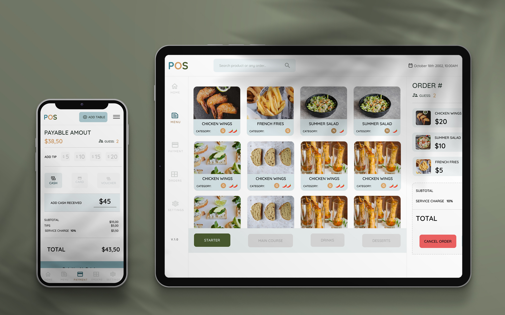

<h1>POS system (responsive)</h1>
<h2>What does contains?</h2>

This project was created from 0 to give it the functionality of the system.

3 functional sections have been done for now, but the whole execution process works perfectly

<h2>What I used for this?</h2>

I used for this project ***SCSS**, ***VANILLA JS**, **PUG to generate dynamic template and my Own JSON.Api with Fetch

Any question let me know!

